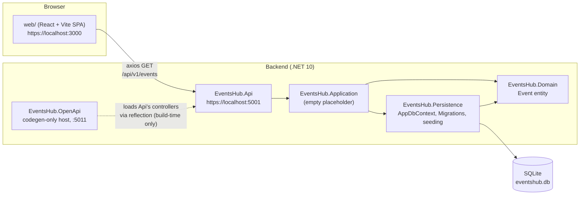

# EventsHub — Architecture

EventsHub is a school project (ICI 2026 01): a small events-listing app made
of two independent, separately-built applications that share this one repo —
a .NET 10 Web API backend (`src/`, `tests/`) and a React/Vite single-page
frontend (`web/`). There is no shared build, no shared package, and no
monorepo tooling (no Nx/Turborepo/workspaces) tying them together; the only
thing connecting them at runtime is an HTTP call from the browser to the API.

## System overview

The dotted edge is not a runtime dependency: `EventsHub.OpenApi` is a
separate host process used only to generate `src/openapi/EventsHub.v1.json`
and the typed C# client under
`src/EventsHub.OpenApi/Generated/EventsHubRpcClient.generated.cs`. It never
runs alongside the real API.

## Request walkthrough

A typical read, end to end:

1. The SPA's `App.tsx` fires `axios.get('https://localhost:5001/api/v1/events')`
   on mount (`web/src/App.tsx`) — the base URL is currently hardcoded, not
   read from an env var.
2. The request hits `EventsController` (`src/EventsHub.Api/Controllers/EventsController.cs`),
   which derives from `EventsHubBaseController` and therefore answers at
   `api/v1/Events`.
3. `EventsController` is constructed with `AppDbContext` injected directly
   (primary-constructor DI) and queries `context.Events` with EF Core —
   there is no service/repository layer in between, even though
   `EventsHub.Application` exists in the project graph as if there should be
   one.
4. EF Core translates the LINQ query to SQL against the SQLite file
   `eventshub.db`, using the schema described by
   `src/EventsHub.Persistence/Migrations/`.
5. The `Event` entity (`src/EventsHub.Domain/Event.cs`) is serialized
   straight back as JSON — it is simultaneously the persistence entity, the
   domain model, and the API's response DTO. There is no separate DTO or
   mapping layer.
6. CORS (`app.UseCors(...)` in `src/EventsHub.Api/Program.cs`) only allows
   `http://localhost:3000` / `https://localhost:3000`, i.e. exactly the Vite
   dev server — this is a dev-only setup, there's no environment-specific
   CORS config yet.

On every process start, `Program.cs` also runs `context.Database.MigrateAsync()`
followed by `DbInitializer.SeedDataAsync(context)` inside a try/catch that
only logs — a migration/seed failure is swallowed, not fatal, so the app can
come up serving against a stale or partially-migrated schema without
crashing. `SeedDataAsync` itself is idempotent (no-ops if `Events` already
has rows), seeding 10 fixed events at Mexican venues spanning roughly nine
months in the past to eight months in the future.

## Architectural pattern

The project layout is shaped like Clean Architecture — `Domain` at the
center, `Persistence` and `Application` around it, `Api` as the outermost
layer — and the `.csproj` reference graph enforces that shape:
`Api → Application → {Domain, Persistence}`, `Persistence → Domain`. But the
pattern is not actually followed in code:

- **`EventsHub.Application` is empty.** It has no files beyond its
  `.csproj`. Its only role today is structural: because `Api` references
  only `Application`, and project references are transitive, `Api` reaches
  `Persistence`/`Domain` *through* `Application` without ever declaring a
  direct reference to either. If `Application` were deleted, `Api`'s
  `using EventsHub.Persistence;` in `Program.cs` would stop compiling.
- **Controllers talk to EF Core directly.** `EventsController` injects
  `AppDbContext` and writes LINQ queries inline — there's no service layer,
  no repository abstraction, no MediatR/CQRS pipeline.
- **No DTOs.** `Event` is used as-is for both persistence and the wire
  format.

This should be read as an early-stage/teaching-project snapshot, not a
finished design — new backend work should decide explicitly whether to
start filling in `Application` (services, DTOs, mapping) or to keep the
current direct-to-`Api` shape and drop the unused layer. Don't assume
`Application` does something it doesn't.

## Generated vs. hand-maintained

| Path | Origin | Rule |
|---|---|---|
| `src/EventsHub.*/**/*.cs` (excluding migrations) | Hand-written | Edit directly |
| `src/EventsHub.Persistence/Migrations/**` | `dotnet ef migrations add` | Regenerate via EF CLI; don't hand-edit |
| `src/nswag/EventsHub.nswag` | Hand-authored | Edit only to change codegen config |
| `src/openapi/EventsHub.v1.json` | NSwag, from `EventsHub.OpenApi`'s served doc | **Never hand-edit** |
| `src/EventsHub.OpenApi/Generated/EventsHubRpcClient.generated.cs` | NSwag CLI | **Never hand-edit** |

Full step-by-step provenance (exact commands used to scaffold every piece of
`src/`) is in [`docs/BackendBuildSteps.md`](BackendBuildSteps.md).

## Cross-cutting conventions actually in use

- **Routing:** every API controller derives from `EventsHubBaseController`
  (`[Route("api/v1/[controller]")]`, `[ApiController]`) instead of declaring
  its own route — including `WeatherForecastController`, which is the
  unmodified ASP.NET template controller re-parented onto this base rather
  than removed.
- **IDs:** the one entity that exists (`Event`) uses a client-generated
  `Guid.NewGuid().ToString()` string as its primary key, not a
  database-generated integer.
- **Nullability:** all five .NET projects have `Nullable` and
  `ImplicitUsings` enabled, targeting `net10.0`.
- **Testing:** unit tests bypass HTTP entirely and call controllers
  in-process against a real (not mocked) shared SQLite context; there is a
  second, separate integration-test suite that *does* exercise real HTTP,
  but through Bruno, not `dotnet test`. See
  [`src/EventsHub.Api/README.md`](../src/EventsHub.Api/README.md#testing)
  for how the two relate.

## Components

| Component | What it is | README |
|---|---|---|
| `src/EventsHub.Domain` | Entities (`Event`) | [README](../src/EventsHub.Domain/README.md) |
| `src/EventsHub.Persistence` | EF Core `AppDbContext`, migrations, seeding | [README](../src/EventsHub.Persistence/README.md) |
| `src/EventsHub.Application` | Unused placeholder layer | [README](../src/EventsHub.Application/README.md) |
| `src/EventsHub.Api` | The real ASP.NET Core Web API | [README](../src/EventsHub.Api/README.md) |
| `src/EventsHub.OpenApi` | Standalone OpenAPI-doc/codegen host | [README](../src/EventsHub.OpenApi/README.md) |
| `web/` | React + Vite + MUI frontend | [README](../web/README.md) |
