# Clean Architecture Fundamentals

A reference guide to Clean Architecture in .NET: what it is, how the layers fit together, the patterns that usually accompany it, how to test it, and when to leave it alone. Examples use C# and the EventsHub domain (events, venues, attendees) so the ideas stay concrete.

**How to read this guide.** Each topic carries a depth label, shown both in its heading and in a blockquote at the top of its body:

| Depth | Meaning |
|---|---|
| **General** | Concepts and vocabulary. No prior knowledge of the pattern needed. |
| **Intermediate** | Working knowledge: how to apply the idea in a real .NET solution. |
| **Advanced** | Trade-offs, edge cases, and design decisions. |

**About the code samples.** Samples omit `using` directives and a few supporting types (`Attendee`, `DomainException`, `IDomainEvent`, `AttendeeRegistered`, `ApplicationAssemblyMarker`) to stay focused on the idea being shown. Treat them as illustrations to adapt, not copy-paste-ready files.

**Contents**

1. [Foundations](#part-1--foundations) (topics 1–5)
2. [Layers in a .NET solution](#part-2--layers-in-a-net-solution) (topics 6–10)
3. [Key patterns](#part-3--key-patterns) (topics 11–17)
4. [Cross-cutting concerns](#part-4--cross-cutting-concerns) (topics 18–20)
5. [Testing](#part-5--testing) (topics 21–24)
6. [Practice and pitfalls](#part-6--practice-and-pitfalls) (topics 25–29)

---

## Part 1 — Foundations

### 1. What Clean Architecture Is and the Problem It Solves — General

> **Depth: General**

Most applications start simple and slowly become hard to change. Business rules end up inside controllers, controllers call the database directly, and the database schema leaks into the user interface. Every change touches everything, tests need a running database, and upgrading a framework becomes a project of its own.

Clean Architecture, described by Robert C. Martin, is a way of organizing code so that **the business rules sit at the center and everything else depends on them, never the other way around**. The database, the web framework, the message broker, and the UI are treated as details that can be replaced without rewriting the rules.

The problems it targets:

- **Coupling.** Business logic that knows about HTTP, SQL, or a specific library cannot be reused or changed independently.
- **Poor testability.** If a rule can only be exercised through a running web server and a database, tests are slow and fragile.
- **Framework lock-in.** When the framework is woven through every file, upgrading or swapping it is a rewrite.
- **Unclear boundaries.** Without layers, nobody knows where a new piece of logic belongs, so it lands wherever is convenient.

What you get in return: rules that are testable in milliseconds, infrastructure choices that can be deferred or changed, and a codebase where the location of any piece of logic is predictable. What it costs: more projects, more interfaces, and more mapping code. Topic 27 covers when that cost is not worth paying.

### 2. Origins and Related Styles: Hexagonal, Onion, and Clean — General

> **Depth: General**

Clean Architecture did not appear from nothing. It is a synthesis of several earlier ideas that share one goal: isolate the domain from technical concerns.

| Style | Author / year | Core idea |
|---|---|---|
| **Hexagonal (Ports & Adapters)** | Alistair Cockburn, 2005 | The application core exposes *ports* (interfaces); *adapters* (web, database, queue) plug into them from outside. |
| **Onion Architecture** | Jeffrey Palermo, 2008 | Concentric layers with the domain model at the center; all coupling points inward. |
| **Clean Architecture** | Robert C. Martin, 2012 | Unifies the above into four named circles governed by a single Dependency Rule. |

They differ mostly in vocabulary and in how many layers they name. In practice, a .NET solution built in any of the three styles looks very similar: a domain core, an application layer with use cases and abstractions, and outer projects that implement those abstractions.

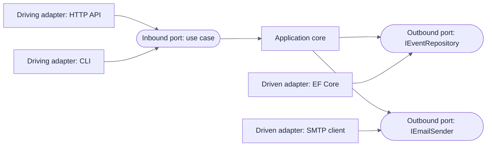

The practical takeaway is that the names matter less than the discipline. If you can state the Dependency Rule (next topic) and your project references obey it, you are practicing this family of architectures.

### 3. The Dependency Rule — General

> **Depth: General**

The whole architecture rests on one rule:

> **Source code dependencies must point only inward, toward higher-level policies.**

An inner layer must not know anything about an outer layer: no `using` statement, no project reference, no type name. The inner layer defines *what it needs* as an interface, and the outer layer supplies the implementation. That reversal is called **dependency inversion**.

A concrete example. The application needs to save an event. It does not call EF Core; it depends on an interface it owns:

```csharp
// Application layer: defines what it needs
public interface IEventRepository
{
    Task AddAsync(Event @event, CancellationToken ct);
    Task<Event?> GetByIdAsync(Guid id, CancellationToken ct);
}
```

```csharp
// Persistence layer: implements it, using EF Core
internal sealed class EventRepository(EventsHubDbContext db) : IEventRepository
{
    public async Task AddAsync(Event @event, CancellationToken ct) =>
        await db.Events.AddAsync(@event, ct);

    public Task<Event?> GetByIdAsync(Guid id, CancellationToken ct) =>
        db.Events.FirstOrDefaultAsync(e => e.Id == id, ct);
}
```

At runtime, control flows from the API to the application to the database. At compile time, the dependency arrow between application and persistence points the *opposite* way: persistence references application, not the reverse.

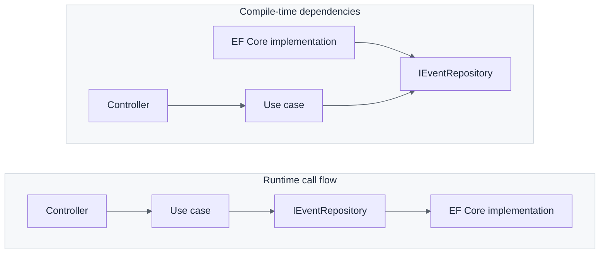

### 4. The Concentric-Circles Diagram — General

> **Depth: General**

Martin's diagram names four circles. Each maps to code you can point at.

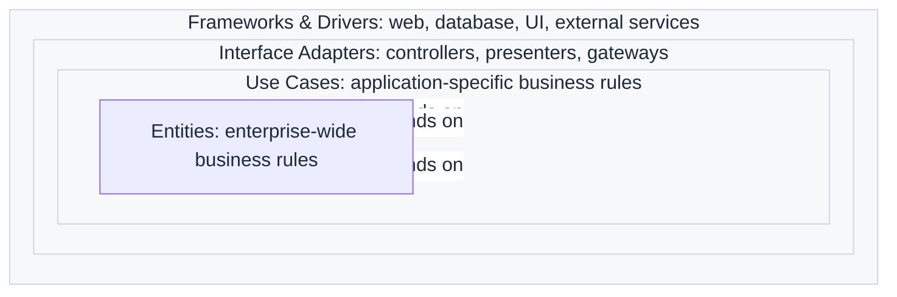

| Circle | Contains | Changes when… | .NET equivalent |
|---|---|---|---|
| **Entities** | Enterprise-wide rules and data that would exist even without software | The business itself changes | `Domain` project |
| **Use Cases** | Application-specific workflows that orchestrate entities | A feature or workflow changes | `Application` project |
| **Interface Adapters** | Converters between use-case data and external formats | An API shape or storage format changes | Controllers, DTO mappers, repositories |
| **Frameworks & Drivers** | The glue to concrete technology | You change tools or vendors | ASP.NET Core host, EF Core, SDK clients |

The number of circles is not sacred. Martin himself says you may need more or fewer. What matters is that the dependency arrows keep pointing inward.

### 5. SOLID Principles as the Basis — Intermediate

> **Depth: Intermediate**

Clean Architecture applies the SOLID principles at the scale of whole projects. Knowing them makes the structure feel like consequences instead of conventions.

| Principle | Statement | How it shows up |
|---|---|---|
| **S**ingle Responsibility | A module has one reason to change. | One handler per use case; entities hold rules, repositories hold persistence. |
| **O**pen/Closed | Open for extension, closed for modification. | New behavior arrives as a new handler or pipeline behavior, not edits to existing ones. |
| **L**iskov Substitution | Subtypes must be usable wherever the base type is. | A fake repository in tests behaves like the real one from the caller's view. |
| **I**nterface Segregation | Prefer small, focused interfaces. | `IEventRepository` instead of one giant `IDataAccess`. |
| **D**ependency Inversion | Depend on abstractions, not concretions. | The Dependency Rule itself: inner layers own the interfaces. |

**Dependency Inversion is the load-bearing one.** Without it, the Application layer would have to reference Persistence to save data, and the dependency arrows would point outward. With it, Application declares `IEventRepository`, Persistence implements it, and the arrows point inward.

A quick smell test for Interface Segregation: if a test double has to implement ten members to satisfy a class that only calls one, the interface is too wide.

---

## Part 2 — Layers in a .NET Solution

### 6. The Domain Layer — Intermediate

> **Depth: Intermediate**

The Domain project holds the business model and has **no dependencies** on any other project or on infrastructure packages. It should compile with only the base class library.

**Entities** have identity and a lifecycle. Two events with the same data but different IDs are different events.

**Value objects** have no identity; they are defined by their values and are immutable. In C#, a `record` is a natural fit.

**Aggregates** are clusters of entities and value objects treated as one consistency unit, with one **aggregate root** as the only entry point. Outside code changes the aggregate through the root's methods, which protect the invariants.

**Domain events** record that something meaningful happened (`EventPublished`), so other parts of the system can react without the aggregate knowing who is listening.

**Domain exceptions** (or results) signal violated business rules.

```csharp
public sealed record DateRange
{
    public DateTimeOffset Start { get; }
    public DateTimeOffset End { get; }

    public DateRange(DateTimeOffset start, DateTimeOffset end)
    {
        if (end <= start)
            throw new DomainException("End must be after start.");
        Start = start;
        End = end;
    }
}

public sealed class Event   // aggregate root
{
    private readonly List<Attendee> _attendees = [];
    private readonly List<IDomainEvent> _domainEvents = [];

    public Guid Id { get; private set; }
    public string Title { get; private set; }
    public DateRange Schedule { get; private set; }
    public int Capacity { get; private set; }
    public IReadOnlyCollection<Attendee> Attendees => _attendees;
    public IReadOnlyCollection<IDomainEvent> DomainEvents => _domainEvents;

    private Event() { }   // for EF Core

    public static Event Create(string title, DateRange schedule, int capacity)
    {
        if (string.IsNullOrWhiteSpace(title))
            throw new DomainException("Title is required.");
        if (capacity <= 0)
            throw new DomainException("Capacity must be positive.");

        return new Event
        {
            Id = Guid.NewGuid(),
            Title = title,
            Schedule = schedule,
            Capacity = capacity
        };
    }

    public void Register(Attendee attendee)
    {
        if (_attendees.Count >= Capacity)
            throw new DomainException("The event is full.");
        _attendees.Add(attendee);
        _domainEvents.Add(new AttendeeRegistered(Id, attendee.Id));
    }
}
```

Notice what the entity does: it enforces its own rules and exposes behavior (`Register`), not public setters. That is the difference between a rich domain model and the anemic one described in topic 26.

### 7. The Application Layer — Intermediate

> **Depth: Intermediate**

The Application project contains the **use cases**: the things the system can do. It orchestrates domain objects, but it does not contain business rules itself (those live in the domain) and it does not know how data is stored or delivered.

It typically holds:

- **Use case handlers**: one per operation (`CreateEvent`, `RegisterAttendee`).
- **Abstractions**: interfaces the outer layers implement (`IEventRepository`, `IClock`, `IEmailSender`, `IUnitOfWork`).
- **DTOs**: the shapes of data entering and leaving use cases.
- **Validation**: checks on input shape, distinct from domain invariants.

```csharp
public sealed record CreateEventCommand(
    string Title, DateTimeOffset Start, DateTimeOffset End, int Capacity);

public sealed class CreateEventHandler(
    IEventRepository events,
    IUnitOfWork unitOfWork)
{
    public async Task<Guid> HandleAsync(CreateEventCommand cmd, CancellationToken ct)
    {
        var schedule = new DateRange(cmd.Start, cmd.End);
        var @event = Event.Create(cmd.Title, schedule, cmd.Capacity);

        await events.AddAsync(@event, ct);
        await unitOfWork.SaveChangesAsync(ct);

        return @event.Id;
    }
}
```

Two kinds of validation are easy to conflate. **Input validation** ("the title is not empty, the email looks like an email") belongs at the application boundary. **Domain invariants** ("an event cannot exceed its capacity") belong in the domain, because they must hold no matter who calls the code.

### 8. The Infrastructure / Persistence Layer — Intermediate

> **Depth: Intermediate**

This layer implements the abstractions declared by the Application layer using concrete technology. In EventsHub it is the Persistence project; larger solutions often add a separate Infrastructure project for non-database services.

Typical contents:

- The EF Core `DbContext`, entity configurations, and migrations.
- Repository implementations.
- Clients for external services: email, payment, storage, message brokers.
- Implementations of `IClock`, `IFileStore`, and similar small abstractions.

```csharp
public sealed class EventsHubDbContext(DbContextOptions<EventsHubDbContext> options)
    : DbContext(options), IUnitOfWork
{
    public DbSet<Event> Events => Set<Event>();

    protected override void OnModelCreating(ModelBuilder modelBuilder) =>
        modelBuilder.ApplyConfigurationsFromAssembly(typeof(EventsHubDbContext).Assembly);
}
```

```csharp
internal sealed class EventConfiguration : IEntityTypeConfiguration<Event>
{
    public void Configure(EntityTypeBuilder<Event> builder)
    {
        builder.HasKey(e => e.Id);
        builder.Property(e => e.Title).HasMaxLength(200).IsRequired();
        builder.OwnsOne(e => e.Schedule);
        builder.HasMany(e => e.Attendees).WithOne();
        builder.Ignore(e => e.DomainEvents);
    }
}
```

Keeping mapping in `IEntityTypeConfiguration` classes, rather than data annotations on entities, keeps EF Core attributes out of the Domain project. This is one of the most common places where the Dependency Rule is quietly broken.

Each service registers itself through an extension method so the API host does not need to know the implementation types:

```csharp
public static class PersistenceServiceRegistration
{
    public static IServiceCollection AddPersistence(
        this IServiceCollection services, IConfiguration config)
    {
        services.AddDbContext<EventsHubDbContext>(o =>
            o.UseSqlServer(config.GetConnectionString("EventsHub")));
        services.AddScoped<IUnitOfWork>(sp => sp.GetRequiredService<EventsHubDbContext>());
        services.AddScoped<IEventRepository, EventRepository>();
        return services;
    }
}
```

### 9. The Presentation / API Layer — General

> **Depth: General**

The API project is the delivery mechanism. Its job is small: translate an HTTP request into a use-case call and translate the result back into an HTTP response. It should contain almost no logic.

A thin controller does four things: bind the request, call the use case, map the result, choose the status code.

```csharp
[ApiController]
[Route("api/events")]
public sealed class EventsController(CreateEventHandler createEvent) : ControllerBase
{
    [HttpPost]
    [ProducesResponseType(typeof(Guid), StatusCodes.Status201Created)]
    public async Task<IActionResult> Create(CreateEventRequest request, CancellationToken ct)
    {
        var id = await createEvent.HandleAsync(
            new CreateEventCommand(request.Title, request.Start, request.End, request.Capacity),
            ct);

        return CreatedAtAction(nameof(GetById), new { id }, id);
    }

    [HttpGet("{id:guid}")]
    public Task<IActionResult> GetById(Guid id, CancellationToken ct) =>
        throw new NotImplementedException();   // a query handler, see topic 13
}
```

Minimal APIs achieve the same thing with `app.MapPost("/api/events", …)`. Either style is fine; the rule is the same. If a controller method grows past a few lines of orchestration, logic is leaking out of the Application layer.

The API project is also the **composition root** (topic 11): it is the only place that knows about every layer, because it wires them together at startup.

### 10. Project References and Enforcing the Dependency Direction — Intermediate

> **Depth: Intermediate**

In .NET, the Dependency Rule is enforced most directly by **project references**. If `Domain` has no `ProjectReference`, it physically cannot use anything from outer layers.

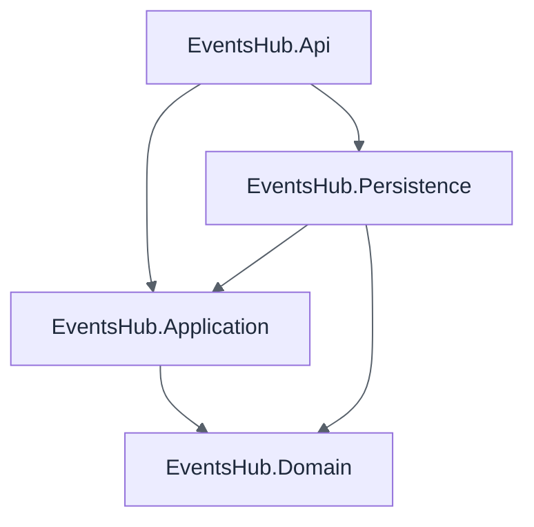

| Project | References | Must not reference |
|---|---|---|
| `Domain` | nothing | everything else |
| `Application` | `Domain` | `Persistence`, `Api`, EF Core, ASP.NET Core |
| `Persistence` | `Application`, `Domain` | `Api` |
| `Api` | `Application`, `Persistence` (only to register services) | — |

Three practical safeguards:

1. **Watch package references, not just project references.** If `Application.csproj` gains `Microsoft.EntityFrameworkCore`, the rule is already broken even though no project reference changed.
2. **Keep implementations `internal`** in outer layers where possible. Only the registration extension method needs to be public.
3. **Add architecture tests** (topic 24) so a wrong reference fails the build instead of surviving until code review.

---

## Part 3 — Key Patterns

### 11. Dependency Injection and the Composition Root — Intermediate

> **Depth: Intermediate**

**Dependency Injection (DI)** means a class receives its collaborators from outside instead of creating them. It is the mechanism that makes the Dependency Rule workable: the use case asks for an `IEventRepository`, and something else decides which implementation to provide.

The **composition root** is the single place where the object graph is assembled. In ASP.NET Core this is `Program.cs`. Everything else in the codebase should only *receive* dependencies through constructors.

```csharp
var builder = WebApplication.CreateBuilder(args);

builder.Services
    .AddApplication()                          // handlers, validators, behaviors
    .AddPersistence(builder.Configuration);    // DbContext, repositories

builder.Services.AddControllers();

var app = builder.Build();
app.MapControllers();
app.Run();
```

Each layer exposes one `AddXxx` extension so the host stays short and each layer owns its own registrations.

**Lifetimes** matter:

| Lifetime | Instance per… | Typical use |
|---|---|---|
| Transient | Every request for the service | Lightweight, stateless services |
| Scoped | HTTP request | `DbContext`, repositories, unit of work |
| Singleton | Application lifetime | Caches, configuration, stateless clients |

The classic mistake is injecting a scoped service (such as a `DbContext`) into a singleton. ASP.NET Core can detect this in Development with scope validation, which is worth leaving on.

Avoid the **service locator** anti-pattern (calling `serviceProvider.GetService<T>()` inside business code). It hides dependencies and defeats the point of constructor injection.

### 12. Repository and Unit of Work — Advanced

> **Depth: Advanced**

A **repository** presents an aggregate as if it were an in-memory collection: add, remove, fetch by ID. A **unit of work** tracks changes and commits them together in one transaction.

```csharp
public interface IEventRepository
{
    Task<Event?> GetByIdAsync(Guid id, CancellationToken ct);
    Task AddAsync(Event @event, CancellationToken ct);
    void Remove(Event @event);
}

public interface IUnitOfWork
{
    Task<int> SaveChangesAsync(CancellationToken ct);
}
```

**The debate.** EF Core's `DbContext` already implements both patterns: `DbSet<T>` behaves like a repository and `SaveChanges` is a unit of work. So wrapping it in another repository can look like pointless indirection. The two camps:

| Position | Argument |
|---|---|
| **Wrap EF Core** | The Application layer stays free of EF Core types; tests can use simple fakes; queries are named after business intent. |
| **Use `DbContext` directly** | Less code; access to `Include`, projections, and `AsNoTracking` without reinventing them; a generic repository over EF usually just re-exposes EF badly. |

A pragmatic middle path that many teams settle on:

- **Repositories for aggregates on the write side**, one per aggregate root, with only the methods the use cases need. Avoid the generic `IRepository<T>` with `GetAll()` returning `IQueryable<T>`, which leaks the ORM through the abstraction.
- **Read side queries directly against the database** (via `DbContext` or a query interface), returning DTOs, since reads do not need to load aggregates.

Neither answer is universally right. Decide once per project, write it down, and stay consistent.

### 13. CQRS: Commands vs. Queries — Intermediate

> **Depth: Intermediate**

**Command Query Responsibility Segregation** separates operations that *change state* (commands) from operations that *read state* (queries).

| | Command | Query |
|---|---|---|
| Intent | Change something | Ask something |
| Returns | Nothing, or an ID / result | Data (a DTO) |
| Side effects | Yes | None |
| Goes through | Domain model, aggregates | Often straight to the database, projected to DTOs |
| Example | `CreateEvent`, `CancelEvent` | `GetEventById`, `ListUpcomingEvents` |

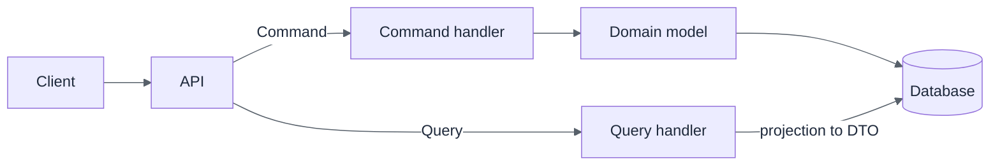

The benefit is that each side is optimized for its job. Writes go through the domain model to protect invariants. Reads skip the model and project straight into the exact shape the client needs, which is simpler and faster.

CQRS is a **spectrum**, not an all-or-nothing choice:

1. **Same code path, separate types.** Commands and queries are distinct classes and handlers, sharing one database. This is what most Clean Architecture solutions mean by CQRS, and it is enough for most projects.
2. **Separate read and write models** over the same database (for example, EF Core for writes, Dapper or projections for reads).
3. **Separate read and write stores**, synchronized by events. This adds eventual consistency and real operational complexity; adopt it only with a demonstrated need.

### 14. MediatR and Pipeline Behaviors — Advanced

> **Depth: Advanced**

**MediatR** is a popular in-process mediator library. Controllers send a request object; MediatR finds and invokes the matching handler. This decouples the API from concrete handler classes and gives one place to attach cross-cutting behavior.

> Note: recent MediatR versions moved to a commercial license for some use cases. Check the current terms, and remember that the pattern itself is easy to implement without the library if you prefer.

Compared with topic 7, the command now implements `IRequest<TResponse>` and the handler implements `IRequestHandler<,>`, whose method must be named `Handle`.

```csharp
public sealed record CreateEventCommand(
    string Title, DateTimeOffset Start, DateTimeOffset End, int Capacity)
    : IRequest<Guid>;

public sealed class CreateEventHandler(IEventRepository events, IUnitOfWork uow)
    : IRequestHandler<CreateEventCommand, Guid>
{
    public async Task<Guid> Handle(CreateEventCommand cmd, CancellationToken ct)
    {
        var @event = Event.Create(cmd.Title, new DateRange(cmd.Start, cmd.End), cmd.Capacity);
        await events.AddAsync(@event, ct);
        await uow.SaveChangesAsync(ct);
        return @event.Id;
    }
}
```

The controller now depends only on `ISender`:

```csharp
public sealed class EventsController(ISender sender) : ControllerBase
{
    [HttpPost]
    public async Task<IActionResult> Create(CreateEventRequest r, CancellationToken ct)
    {
        var id = await sender.Send(new CreateEventCommand(r.Title, r.Start, r.End, r.Capacity), ct);
        return Created($"/api/events/{id}", id);
    }
}
```

**Pipeline behaviors** wrap every request like middleware, so logging, validation, and transactions are written once:

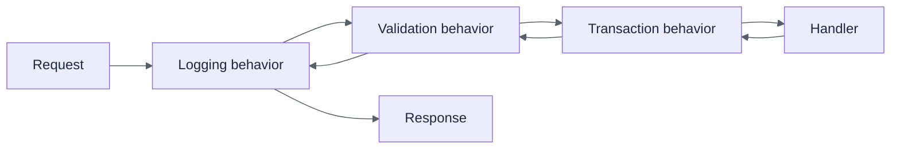

```csharp
public sealed class ValidationBehavior<TRequest, TResponse>(
    IEnumerable<IValidator<TRequest>> validators)
    : IPipelineBehavior<TRequest, TResponse> where TRequest : notnull
{
    public async Task<TResponse> Handle(
        TRequest request, RequestHandlerDelegate<TResponse> next, CancellationToken ct)
    {
        var failures = validators
            .Select(v => v.Validate(request))
            .SelectMany(r => r.Errors)
            .Where(f => f is not null)
            .ToList();

        if (failures.Count != 0)
            throw new ValidationException(failures);

        return await next();
    }
}
```

**Trade-offs to weigh.** The mediator adds indirection: "go to definition" on `Send` no longer leads to the handler. It suits solutions with many use cases and shared cross-cutting behavior. For a small API it may be overhead. Also, behaviors execute for every request, so keep them fast and generic.

### 15. The Result Pattern vs. Exceptions — Intermediate

> **Depth: Intermediate**

There are two ways to signal that an operation failed.

**Exceptions** interrupt the normal flow and unwind the stack. They are the right tool for *unexpected* conditions: a lost database connection, a programming error, a broken invariant that should never occur.

**The Result pattern** returns success or failure as an ordinary value. It suits *expected* outcomes: "event not found", "event is full", "email already registered". These are normal business results, not exceptional ones.

```csharp
public sealed record Error(string Code, string Message)
{
    public static readonly Error None = new(string.Empty, string.Empty);
}

public class Result
{
    protected Result(bool isSuccess, Error error)
    {
        IsSuccess = isSuccess;
        Error = error;
    }

    public bool IsSuccess { get; }
    public bool IsFailure => !IsSuccess;
    public Error Error { get; }

    public static Result Success() => new(true, Error.None);
    public static Result Failure(Error error) => new(false, error);
}

public sealed class Result<T> : Result
{
    private readonly T? _value;
    private Result(T value) : base(true, Error.None) => _value = value;
    private Result(Error error) : base(false, error) { }

    public T Value => IsSuccess
        ? _value!
        : throw new InvalidOperationException("No value on a failed result.");

    public static Result<T> Success(T value) => new(value);
    public static new Result<T> Failure(Error error) => new(error);
}
```

Using it in a handler and mapping it at the edge:

```csharp
// Handler
if (@event is null)
    return Result<EventDto>.Failure(EventErrors.NotFound(id));

// Controller
var result = await sender.Send(new GetEventQuery(id), ct);
return result.IsSuccess ? Ok(result.Value) : NotFound(result.Error);
```

| | Exceptions | Result |
|---|---|---|
| Visible in the method signature | No | Yes |
| Cost when failure is common | High (stack unwinding) | Negligible |
| Forces callers to handle failure | No | Yes, if they read the result |
| Best for | Unexpected, unrecoverable problems | Predictable business outcomes |

A common blend: **use Results for expected failures inside the Application layer, and reserve exceptions for truly exceptional situations**, with a global exception handler translating the rest to `500` responses. The important thing is a consistent convention, so the API can translate errors into HTTP status codes (and `ProblemDetails`) in one place.

### 16. Mapping and DTO Boundaries — Intermediate

> **Depth: Intermediate**

A **DTO** (data transfer object) is a plain data shape used to cross a boundary. Domain entities should not cross the API boundary directly, for three reasons: they may expose data you do not want to publish, their shape would lock your public contract to your internal model, and serialization of navigation properties can cause cycles or accidental lazy loading.

Typically there are separate shapes at each boundary:

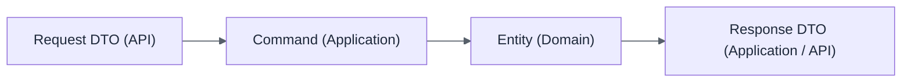

Options for moving data between them:

| Approach | Pros | Cons |
|---|---|---|
| **Manual mapping** (static methods, extensions) | Explicit, debuggable, compile-time checked, no dependency | More typing |
| **Mapster** | Fast, code generation option, less reflection | Configuration by convention can hide gaps |
| **AutoMapper** | Widely known, flexible | Runtime failures for missing maps; encourages mapping domain entities carelessly; commercial license for recent versions |

```csharp
public static class EventMappings
{
    public static EventDto ToDto(this Event e) =>
        new(e.Id, e.Title, e.Schedule.Start, e.Schedule.End, e.Capacity, e.Attendees.Count);
}
```

For **queries**, prefer projecting directly in the database query rather than loading an entity and then mapping:

```csharp
db.Events
  .AsNoTracking()
  .Where(e => e.Schedule.Start > now)
  .Select(e => new EventDto(e.Id, e.Title, e.Schedule.Start, e.Schedule.End, e.Capacity, e.Attendees.Count))
  .ToListAsync(ct);
```

That reads only the columns needed and skips change tracking. Manual mapping is often the best default: the code is boring, but boring is what you want at a boundary.

### 17. Validation with FluentValidation — Intermediate

> **Depth: Intermediate**

FluentValidation expresses input rules in a dedicated class per request, keeping them out of controllers and out of the domain.

```csharp
public sealed class CreateEventCommandValidator : AbstractValidator<CreateEventCommand>
{
    public CreateEventCommandValidator()
    {
        RuleFor(x => x.Title).NotEmpty().MaximumLength(200);
        RuleFor(x => x.Capacity).InclusiveBetween(1, 100_000);
        RuleFor(x => x.End).GreaterThan(x => x.Start)
            .WithMessage("End must be after start.");
    }
}
```

Register all validators from an assembly and run them in a pipeline behavior (see topic 14):

```csharp
services.AddValidatorsFromAssembly(typeof(ApplicationAssemblyMarker).Assembly);
```

**Two layers of defense.** Validators reject malformed input early with friendly, field-level messages. Domain invariants still guard the model, because other callers (a background job, a test, another use case) may not go through the validator. Some duplication between the two is intentional.

| | Input validation | Domain invariants |
|---|---|---|
| Location | Application boundary | Inside entities and value objects |
| Purpose | Good error messages for the caller | Model can never be in an invalid state |
| Failure | List of field errors (`400`) | Domain error or exception |
| Example | "Title is required" | "An event cannot exceed its capacity" |

Validation that needs the database (for example, "title must be unique") belongs in the handler, or behind a domain service, not in a validator that quietly makes queries. It also needs a database constraint as the final guard against race conditions.

---

## Part 4 — Cross-Cutting Concerns

### 18. Logging, Caching, and Authentication / Authorization — Intermediate

> **Depth: Intermediate**

**Cross-cutting concerns** apply across many use cases without belonging to any one. The goal is to add them without polluting business code.

#### Logging

Depend on `ILogger<T>` from `Microsoft.Extensions.Logging`, which is an abstraction, so the Application layer stays free of any specific logging library. Use **structured logging** with message templates, not string concatenation:

```csharp
logger.LogInformation("Event {EventId} created with capacity {Capacity}", id, capacity);
```

Serilog or OpenTelemetry plug in at the composition root. A logging pipeline behavior can record every request's name and duration in one place. Never log secrets or personal data.

#### Caching

Caching is a *policy*, so keep it out of the domain. Define an abstraction the Application layer can use and implement it with `IMemoryCache` or a distributed cache:

```csharp
public interface ICacheService
{
    Task<T?> GetOrCreateAsync<T>(string key, Func<CancellationToken, Task<T>> factory,
        TimeSpan ttl, CancellationToken ct);
}
```

Cache **queries**, not commands. The hard part is invalidation: decide up front which command invalidates which key.

#### Authentication and authorization

- **Authentication** (who are you?) is a delivery concern handled in the API layer's middleware (JWT bearer, cookies, an identity provider).
- **Authorization** (what may you do?) has two levels. Coarse rules ("must be logged in", "must be in the Organizer role") live at the endpoint with `[Authorize]`. Fine-grained rules ("only the event's owner may cancel it") depend on data and belong in the Application layer.

The Application layer should not read `HttpContext`. Give it an abstraction instead:

```csharp
public interface ICurrentUser
{
    Guid? UserId { get; }
    bool IsInRole(string role);
}
```

The API project implements it by reading `HttpContext.User`. Use cases stay testable, and no web types leak inward.

### 19. API Contracts and OpenAPI — Intermediate

> **Depth: Intermediate**

The HTTP API is a **contract** with its consumers. **OpenAPI** is the standard machine-readable description of that contract: paths, verbs, parameters, request and response schemas, status codes.

Why it fits Clean Architecture: request and response DTOs at the edge are the *public* shape, deliberately separate from your entities. OpenAPI documents exactly that boundary and nothing internal.

What a described contract gives you:

- **Interactive documentation** (Swagger UI).
- **Generated clients** in C#, TypeScript, and other languages, so consumers never hand-write HTTP code.
- **Contract testing and breaking-change detection**, by diffing the document between versions.

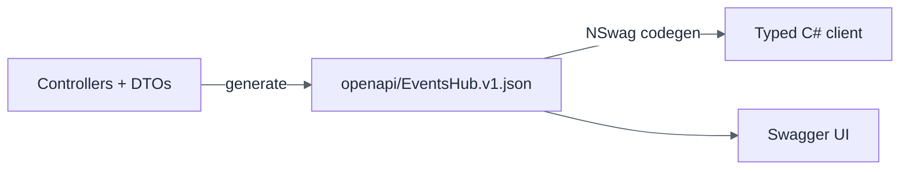

Practices worth adopting:

1. Annotate endpoints with `[ProducesResponseType]` so error responses appear in the document.
2. Use `ProblemDetails` (RFC 9457) as the consistent error body.
3. Treat the generated document as build output, not a hand-edited file, and commit it so changes show up in pull requests.
4. Version the API deliberately (`/api/v1/...`) and avoid breaking a published contract.

The EventsHub OpenAPI setup guide covers the mechanics: a standalone host that loads the API's controllers, a checked-in NSwag configuration, and a pipeline that fetches the document and generates the client.

### 20. Configuration and the Options Pattern — General

> **Depth: General**

Configuration (connection strings, feature flags, external service settings) should reach the code as **strongly typed objects**, not as scattered `configuration["Some:Key"]` string lookups.

The **Options pattern** binds a configuration section to a class:

```json
{
  "Email": {
    "SmtpHost": "smtp.example.com",
    "Port": 587,
    "FromAddress": "no-reply@eventshub.example"
  }
}
```

```csharp
public sealed class EmailOptions
{
    public const string SectionName = "Email";

    [Required] public string SmtpHost { get; init; } = default!;
    [Range(1, 65535)] public int Port { get; init; }
    [Required, EmailAddress] public string FromAddress { get; init; } = default!;
}

services.AddOptions<EmailOptions>()
    .Bind(configuration.GetSection(EmailOptions.SectionName))
    .ValidateDataAnnotations()
    .ValidateOnStart();   // fail fast at startup, not on first use
```

Consume it with `IOptions<T>`:

| Interface | Behavior | Use when |
|---|---|---|
| `IOptions<T>` | Read once at startup | Values never change while running |
| `IOptionsSnapshot<T>` | Re-read per request (scoped) | Values may change between requests |
| `IOptionsMonitor<T>` | Live updates plus change notifications | Singletons that need current values |

**Where the options class lives.** If the Application layer needs a setting, define the options class there (or hide it behind an interface), and bind it in the composition root. Infrastructure-only settings, such as SMTP details, can live entirely in the outer layer.

Keep secrets out of source control: use user secrets in development and a secret store (environment variables, Azure Key Vault, and similar) in production.

---

## Part 5 — Testing

Clean Architecture's biggest practical payoff is testability. Because dependencies point inward and outer details sit behind interfaces, each layer can be tested at the right level.

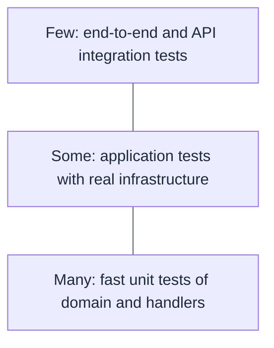

### 21. Unit Testing the Domain and Application Layers — General

> **Depth: General**

A **unit test** exercises a small piece of behavior in isolation, with no database, network, or file system. It should run in milliseconds and fail for exactly one reason.

**Domain tests** are the simplest and most valuable. Entities and value objects have no dependencies, so there is nothing to set up:

```csharp
public class EventTests
{
    [Fact]
    public void Register_WhenEventIsFull_Throws()
    {
        var schedule = new DateRange(DateTimeOffset.UtcNow, DateTimeOffset.UtcNow.AddHours(2));
        var @event = Event.Create("Meetup", schedule, capacity: 1);
        @event.Register(new Attendee(Guid.NewGuid()));

        var act = () => @event.Register(new Attendee(Guid.NewGuid()));

        Assert.Throws<DomainException>(act);
    }
}
```

**Application tests** exercise a handler with its abstractions replaced by test doubles:

```csharp
[Fact]
public async Task Handle_ValidCommand_AddsEventAndSaves()
{
    var repo = new Mock<IEventRepository>();
    var uow = new Mock<IUnitOfWork>();
    var handler = new CreateEventHandler(repo.Object, uow.Object);

    var id = await handler.HandleAsync(
        new CreateEventCommand("Meetup", DateTimeOffset.UtcNow,
            DateTimeOffset.UtcNow.AddHours(2), 50),
        CancellationToken.None);

    repo.Verify(r => r.AddAsync(It.Is<Event>(e => e.Id == id), It.IsAny<CancellationToken>()), Times.Once);
    uow.Verify(u => u.SaveChangesAsync(It.IsAny<CancellationToken>()), Times.Once);
}
```

> The handler here is the plain class from topic 7. With MediatR (topic 14) the method is named `Handle` instead.

Good habits:

- **Arrange, Act, Assert.** Keep the three phases visually separate.
- **Name tests by behavior:** `Method_Condition_ExpectedResult`.
- **Test behavior, not implementation.** Asserting the *outcome* survives refactoring; asserting exact call sequences on mocks often does not.
- **Control time and randomness** by injecting an `IClock` or `TimeProvider` rather than calling `DateTime.UtcNow` inside the code under test.

### 22. Mocking Boundaries — Intermediate

> **Depth: Intermediate**

Test doubles stand in for real dependencies. The vocabulary is worth knowing:

| Double | Purpose |
|---|---|
| **Dummy** | Fills a parameter; never used |
| **Stub** | Returns canned answers |
| **Fake** | A working, simplified implementation (for example, an in-memory repository) |
| **Mock** | Records calls so the test can verify interactions |
| **Spy** | A real object wrapped to record its calls |

**Mock at architectural boundaries**, the interfaces the Application layer owns: repositories, clock, email sender, current user. Do not mock domain entities or value objects; use the real ones, since they are cheap and deterministic.

```csharp
// Moq
var repo = new Mock<IEventRepository>();
repo.Setup(r => r.GetByIdAsync(id, It.IsAny<CancellationToken>()))
    .ReturnsAsync(existingEvent);

// NSubstitute
var repo = Substitute.For<IEventRepository>();
repo.GetByIdAsync(id, Arg.Any<CancellationToken>()).Returns(existingEvent);
```

| Library | Style | Note |
|---|---|---|
| **Moq** | `Setup` / `Verify` | Long-standing and widely known |
| **NSubstitute** | Reads like plain C# | Less ceremony; many teams find it easier to read |
| **Hand-written fakes** | Plain classes | Best for stateful collaborators such as an in-memory repository |

**When a fake beats a mock.** If many tests configure the same repository behavior, write an `InMemoryEventRepository` once. Tests become shorter, and they assert on resulting state instead of on how the handler happened to talk to its dependency.

**Warning sign:** a test with more setup lines than assertions, or one that breaks whenever an internal call is reordered, is coupled to implementation and should be rewritten around outcomes.

### 23. Integration Testing with WebApplicationFactory and a Test Database — Advanced

> **Depth: Advanced**

Unit tests prove the pieces work alone. **Integration tests** prove they work together: routing, model binding, serialization, DI wiring, EF Core mappings, and real SQL.

`WebApplicationFactory<T>` hosts the entire application in memory and provides an `HttpClient` to call it:

```csharp
public sealed class EventsApiFactory : WebApplicationFactory<Program>
{
    protected override void ConfigureWebHost(IWebHostBuilder builder)
    {
        builder.ConfigureTestServices(services =>
        {
            // Replace the real database with the test one
            services.RemoveAll<DbContextOptions<EventsHubDbContext>>();
            services.RemoveAll<IDbContextOptionsConfiguration<EventsHubDbContext>>();
            services.AddDbContext<EventsHubDbContext>(o => o.UseSqlServer(TestDatabase.ConnectionString));
        });
    }
}

public class CreateEventTests(EventsApiFactory factory) : IClassFixture<EventsApiFactory>
{
    [Fact]
    public async Task Post_ValidEvent_Returns201()
    {
        var client = factory.CreateClient();

        var response = await client.PostAsJsonAsync("/api/events",
            new { title = "Meetup", start = "2026-11-01T18:00:00Z", end = "2026-11-01T20:00:00Z", capacity = 50 });

        Assert.Equal(HttpStatusCode.Created, response.StatusCode);
    }
}
```

> With EF Core 9 and later, `AddDbContext` also registers an `IDbContextOptionsConfiguration<TContext>`. Remove both registrations when swapping the provider; otherwise EF Core reports that two database providers are registered.

> If `Program` is `internal` (an implicit top-level program), the test project cannot see it. Either add `public partial class Program { }` to the API project, or use `InternalsVisibleTo`.

**Choosing the test database:**

| Option | Pros | Cons |
|---|---|---|
| **EF Core InMemory provider** | Fast, no setup | Not a relational database: ignores constraints, transactions, and SQL translation. Can pass tests that fail in production. |
| **SQLite in-memory** | Relational, fast | SQL dialect and type differences from your real database |
| **Real engine in a container** (Testcontainers) | Same behavior as production | Slower; needs Docker |

For anything that matters, prefer a **real engine in a container**. It is the only option that reliably catches migration mistakes, constraint violations, and query translation problems.

Keep tests independent: reset the database between tests (for example, with Respawn), give each test its own data, and never depend on execution order.

### 24. Architecture Tests — Advanced

> **Depth: Advanced**

Conventions erode. A tired developer adds `using Microsoft.EntityFrameworkCore;` to an Application class "just this once," and the Dependency Rule is broken. **Architecture tests** turn the rules into failing tests, so the build enforces them.

Two libraries are common: **NetArchTest** and **ArchUnitNET**.

```csharp
public class ArchitectureTests
{
    private static readonly Assembly Domain = typeof(Event).Assembly;
    private static readonly Assembly Application = typeof(CreateEventHandler).Assembly;
    private static readonly Assembly Persistence = typeof(EventsHubDbContext).Assembly;
    private static readonly Assembly Api = typeof(EventsController).Assembly;

    [Fact]
    public void Domain_ShouldNotDependOnOtherLayers()
    {
        var result = Types.InAssembly(Domain)
            .ShouldNot()
            .HaveDependencyOnAny(
                Application.GetName().Name!, Persistence.GetName().Name!, Api.GetName().Name!)
            .GetResult();

        Assert.True(result.IsSuccessful);
    }

    [Fact]
    public void Application_ShouldNotDependOnEfCore()
    {
        var result = Types.InAssembly(Application)
            .ShouldNot()
            .HaveDependencyOn("Microsoft.EntityFrameworkCore")
            .GetResult();

        Assert.True(result.IsSuccessful);
    }

    [Fact]
    public void Handlers_ShouldBeSealed()
    {
        var result = Types.InAssembly(Application)
            .That().HaveNameEndingWith("Handler")
            .Should().BeSealed()
            .GetResult();

        Assert.True(result.IsSuccessful);
    }
}
```

What to enforce:

- **Layer dependencies:** the same table as topic 10, as executable checks.
- **Package restrictions:** no EF Core or ASP.NET Core types in Domain or Application.
- **Naming and visibility conventions:** types named `*Handler` are sealed, repository implementations are `internal`.
- **Design rules:** entities have no public setters; controllers do not reference repositories.

These tests run in milliseconds and belong in the normal CI pipeline. Add a rule whenever a review comment says "we don't do that here" for the second time.

---

## Part 6 — Practice and Pitfalls

### 25. Folder and Project Structure: Layer-Based vs. Feature-Based — Intermediate

> **Depth: Intermediate**

Two decisions are easy to conflate: how you split **projects** (physical, enforced by references) and how you organize **folders** inside them.

#### Layer-based (by technical role)

```text
EventsHub.Application/
├── Commands/
│   ├── CreateEventCommand.cs
│   └── RegisterAttendeeCommand.cs
├── Handlers/
├── Validators/
├── Dtos/
└── Interfaces/
```

Easy to explain, but one feature is scattered across many folders. Adding "cancel event" touches five directories.

#### Feature-based (vertical slices)

```text
EventsHub.Application/
└── Events/
    ├── CreateEvent/
    │   ├── CreateEventCommand.cs
    │   ├── CreateEventHandler.cs
    │   └── CreateEventValidator.cs
    ├── CancelEvent/
    └── GetEventById/
```

Everything for one use case sits together. Changes are local, and features can be understood and removed as units.

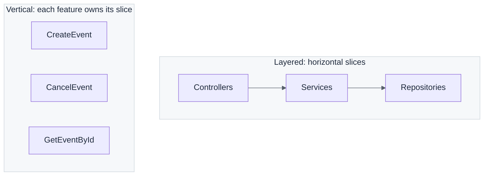

**Vertical Slice Architecture** takes this further: each feature contains everything it needs top to bottom and may choose its own approach (a heavy domain model for one slice, a plain query for another), and slices share little.

| | Clean Architecture (layered) | Vertical Slice |
|---|---|---|
| Organized by | Technical concern | Feature / use case |
| Sharing | Shared domain, shared abstractions | Minimal; duplication tolerated |
| Strength | Strong global rules, protected core | Fast, local change |
| Risk | Ceremony and scattered features | Inconsistency between slices |

The two are not exclusive. A very common and effective hybrid is **Clean Architecture project boundaries with feature folders inside each project**. You keep the enforced dependency direction and gain locality of change.

### 26. Common Mistakes: Anemic Domain, Leaky Abstractions, Over-Engineering — Intermediate

> **Depth: Intermediate**

#### The anemic domain model

Entities are bags of public getters and setters, and all logic lives in "services." The domain project exists but does nothing.

```csharp
// Anemic: any caller can put the object in an invalid state
public class Event
{
    public Guid Id { get; set; }
    public int Capacity { get; set; }
    public List<Attendee> Attendees { get; set; } = new();
}

// The rule lives elsewhere, and can be bypassed
public class EventService
{
    public void Register(Event e, Attendee a)
    {
        if (e.Attendees.Count >= e.Capacity) throw new Exception("Full");
        e.Attendees.Add(a);
    }
}
```

The fix is to move behavior into the entity and remove public setters, as shown in topic 6.

#### Leaky abstractions

An abstraction that exposes the details it was meant to hide.

- A repository method returning `IQueryable<T>`, so callers depend on EF Core query semantics.
- `DbUpdateException` caught in the Application layer.
- Handlers returning `IActionResult` or referencing `HttpContext`.
- Domain entities decorated with `[Table]`, `[JsonProperty]`, or `[Key]` attributes.

Test: *could you replace the outer technology without editing the inner layer?* If not, something leaked.

#### Over-engineering

- An interface for every class, including ones that will only ever have one implementation and no test seam.
- A generic `IRepository<T>` plus a specification framework for a five-table CRUD app.
- Mapping the same object four times across four layers with identical shapes.
- Separate read and write databases before there is any load problem.
- Five projects and a mediator for an API with three endpoints.

#### Other frequent problems

| Mistake | Why it hurts | Remedy |
|---|---|---|
| Business rules in controllers | Cannot be reused or tested without HTTP | Move into the domain or handlers |
| Domain depends on Application | Breaks the Dependency Rule | Domain references nothing |
| One giant "Common" or "Shared" project | Becomes a dumping ground with hidden coupling | Keep shared code small and explicit |
| Handlers calling other handlers | Hidden dependencies, tangled flow | Extract shared logic to a domain or application service |
| Ignoring the read side | Loading full aggregates just to display a list | Project directly into DTOs |

### 27. When *Not* to Use Clean Architecture — General

> **Depth: General**

Clean Architecture buys flexibility and testability by spending simplicity. That is a good trade for a long-lived system with real business rules. It is a bad trade elsewhere.

**It is probably too much when:**

- The application is mostly **CRUD** with little business logic: forms over a database.
- It is a **prototype, proof of concept, or short-lived tool** whose code may be discarded.
- The team is **very small or new to the patterns**, and the learning cost would outweigh the benefit for this project.
- It is a **thin integration or glue service** whose real logic lives elsewhere.
- **Time to first release** is the overriding constraint and the design is still being discovered.

**It pays off when:**

- The system will live and evolve for **years**, with multiple developers.
- There is **substantial domain logic** that deserves protection and fast tests.
- You expect to **change infrastructure**: database, message broker, cloud provider, or UI technology.
- Several **delivery mechanisms** share the same core (an API, a background worker, a CLI).

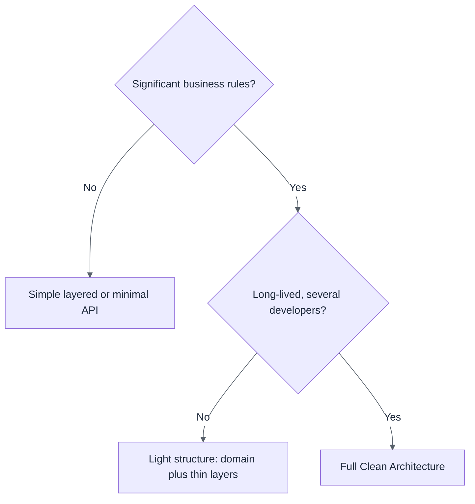

It is not a binary choice. You can adopt the **valuable parts** selectively (a real domain model, dependency inversion at the database boundary, feature folders) and skip the rest (mediator, CQRS with separate stores, four projects). Start simple and add structure when a concrete pain appears, not before.

### 28. Migrating an Existing Codebase Incrementally — Advanced

> **Depth: Advanced**

A big-bang rewrite into Clean Architecture nearly always fails: it freezes feature work, hides risk, and ends up half-finished. Migrate **incrementally**, keeping the system releasable throughout.

**Step-by-step approach:**

1. **Establish a safety net first.** Add characterization tests around current behavior (integration tests through the API are the most efficient starting point). You cannot refactor safely without them.
2. **Stop the bleeding.** Agree that *new* code follows the target structure, even while old code does not. Add architecture tests for the new areas only.
3. **Create the target projects** (`Domain`, `Application`) empty, next to the existing code. Add references in the correct direction.
4. **Extract along a seam, one use case at a time.** Choose a feature, move its business rules out of the controller or service into a handler and domain objects, and hide data access behind an interface.
5. **Invert the first dependencies.** Define interfaces in Application and make the old data-access code implement them. This is where the dependency arrows flip.
6. **Enrich the domain gradually.** Move validation and rules into entities as you touch them. Do not try to model the whole domain up front.
7. **Delete as you go.** Remove old code paths once the new ones are proven, so two systems do not coexist forever.

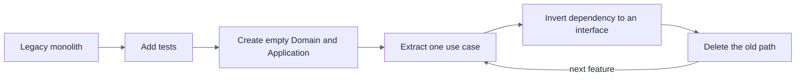

The **strangler fig** pattern is the guiding idea: build the new structure around the old one, route features across one by one, and let the old code shrink until it can be removed.

Prioritize by pain and value. Start with the areas that change most often or hurt most (frequent bugs, slow tests), not the ones that are easiest to move. Stable code that nobody touches can stay as it is indefinitely.

### 29. Guided Exercise: Build "Create Event" Through Every Layer — General

> **Depth: General**

A hands-on exercise of roughly 60–90 minutes that ties the whole guide together. Work in pairs or individually. The goal is one feature, implemented end to end, with the dependency direction respected at every step.

**The requirement.** An organizer can create an event with a title, a start and end time, and a capacity. The API returns the new event's ID. Rules: the title is required (max 200 characters), the end must be after the start, and the capacity must be positive.

**Solution structure:**

```text
EventsHub.slnx
└── src/
    ├── EventsHub.Domain/
    ├── EventsHub.Application/
    ├── EventsHub.Persistence/
    └── EventsHub.Api/
tests/
├── EventsHub.Domain.Tests/
├── EventsHub.Application.Tests/
├── EventsHub.Api.IntegrationTests/
└── EventsHub.ArchitectureTests/
```

#### Steps

| # | Layer | Task | Topics |
|---|---|---|---|
| 1 | Setup | Create the projects and set the references so the direction is correct. | 10 |
| 2 | Domain | Write `DateRange` and `Event.Create` with invariants. No dependencies. | 6 |
| 3 | Domain tests | Test each invariant (empty title, bad capacity, end before start). | 21 |
| 4 | Application | Define `IEventRepository` and `IUnitOfWork`. | 3, 7 |
| 5 | Application | Write `CreateEventCommand`, its handler, and a FluentValidation validator. | 7, 13, 17 |
| 6 | Application tests | Test the handler with mocks or a fake repository. | 21, 22 |
| 7 | Persistence | Add the `DbContext`, the `Event` configuration, a repository, and a migration. | 8 |
| 8 | API | Add the controller or minimal-API endpoint and register services in the composition root. | 9, 11 |
| 9 | Errors | Return `400` for validation failures using `ProblemDetails`. | 15, 17 |
| 10 | Integration | Test `POST /api/events` with `WebApplicationFactory`. | 23 |
| 11 | Architecture | Add tests that the Domain has no outward dependencies and Application has no EF Core reference. | 24 |
| 12 | Contract | Generate the OpenAPI document and confirm `POST /api/events` appears with its response types. | 19 |

#### Stretch goals

- Add `RegisterAttendee` and enforce "an event cannot exceed its capacity" in the domain.
- Add a `GetEventById` query that projects directly to a DTO.
- Add a pipeline behavior that logs each request's name and duration.
- Replace exceptions with the Result pattern for "event not found."

#### Review questions

1. Which project can you delete without breaking the compilation of `Domain`?
2. What would it take to switch from SQL Server to PostgreSQL? Which projects change?
3. Where does each rule live, and why: "title required", "end after start", "capacity positive"?
4. Which of your tests run without a database, and how long do they take?
5. Try adding `using Microsoft.EntityFrameworkCore;` to a class in Application. Which test fails?

**Success criteria.** The feature works end to end, the domain and handler tests run without any infrastructure, the architecture tests pass, and you can explain, for any type in the solution, why it lives in the project it does.

---

## Glossary

| Term | Meaning |
|---|---|
| **Aggregate** | A cluster of domain objects treated as one consistency unit, accessed through its root |
| **Composition root** | The single place where the object graph is assembled |
| **CQRS** | Separating operations that change state from operations that read it |
| **Dependency Rule** | Source-code dependencies point only inward |
| **DTO** | A plain data shape used to cross a boundary |
| **Invariant** | A rule that must always hold for a model to be valid |
| **Port / Adapter** | An interface owned by the core / an implementation that plugs into it |
| **Use case** | An application-specific operation, such as "create event" |
| **Value object** | An immutable object defined by its values, with no identity |
| **Vertical slice** | Organizing code by feature instead of by technical layer |
